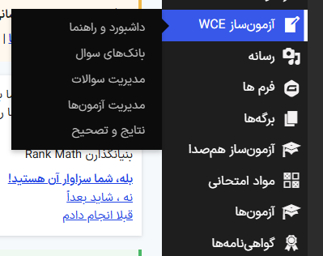
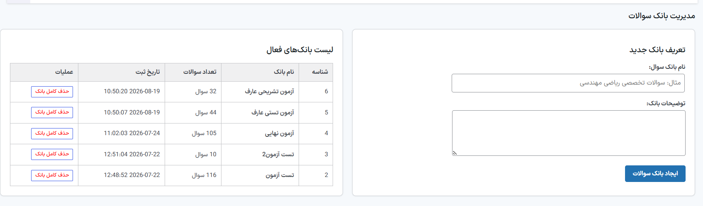
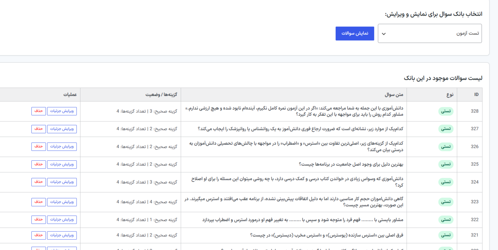
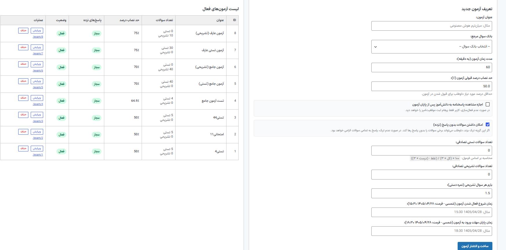
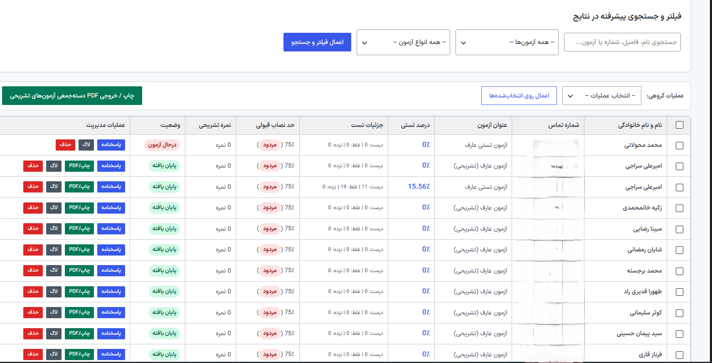
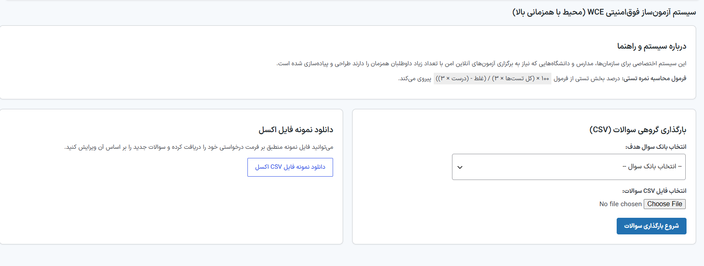

# Study Coach Exam Plugin (WCE)

A custom WordPress online examination management plugin designed for educational platforms, schools, universities, and organizations.

## Overview

Study Coach Exam Plugin (WCE) is a custom-built WordPress examination management system for creating and managing online exams.

The plugin provides tools for question bank management, online examinations, automated grading, descriptive-question grading, result management, configurable exam settings, and examination event logging.

## Features

### Question Management

- Question bank management
- Multiple-choice questions
- Descriptive questions
- Question editing and deletion
- CSV question import
- Sample CSV template

### Exam Management

- Create and manage exams
- Configurable exam duration
- Configurable passing percentage
- Random question selection
- Multiple-choice question count
- Descriptive question count
- Exam start and end time
- Active/inactive exam status
- Unanswered-question configuration

### Examination System

- Dedicated exam URLs
- Countdown timer
- AJAX-based answer saving
- Multiple-choice answers
- Descriptive answers
- Automatic submission
- Candidate answer sheets

### Grading & Results

- Automatic grading for multiple-choice questions
- Manual grading for descriptive questions
- Final score calculation
- Correct / incorrect / unanswered statistics
- Detailed examination results
- CSV result export
- Printable answer sheets

### Monitoring & Security

- WordPress nonce verification
- Administrator capability checks
- Input sanitization
- Prepared database queries
- Examination event logging
- Browser tab visibility monitoring

## Database Architecture

The plugin uses dedicated database tables for:

- Question banks
- Questions
- Exams
- Examination attempts
- Candidate answers
- Examination logs

## Admin Dashboard

The plugin provides dedicated administration sections for:

- Dashboard
- Question Banks
- Questions
- Exams
- Results & Grading
## Screenshots

### Dashboard


### Question Banks


### Questions


### Exams


### Results & Grading


### CSV Import

## Examination Workflow
## Usage

After activating the plugin, the **WCE – Study Coach Exam** menu becomes available in the WordPress administration dashboard.

The typical workflow is:

1. Create a question bank.
2. Add multiple-choice or descriptive questions.
3. Create an examination.
4. Configure exam settings such as duration, passing percentage, and question counts.
5. Publish the examination.
6. Candidates access the dedicated exam URL.
7. Answers are saved during the examination.
8. Multiple-choice questions are graded automatically.
9. Descriptive questions can be graded manually.
10. Review and export examination results.
## Technical Highlights

- Custom WordPress administration interface
- Custom database tables
- WordPress AJAX integration
- Automated examination grading
- Manual descriptive-question grading
- CSV question import
- CSV result export
- Exam countdown and automatic submission
- Nonce-based request verification
- Capability-based access control
- Prepared database queries
- Examination event logging
- Browser visibility monitoring
```text
Create Question Bank
        ↓
Add Questions
        ↓
Create Exam
        ↓
Configure Exam
        ↓
Publish Exam
        ↓
Candidate Takes Exam
        ↓
Automatic / Manual Grading
        ↓
Review Results
## Installation

1. Download the plugin.
2. Upload the plugin file to:

   `wp-content/plugins/`

3. Open the WordPress administration panel.
4. Go to:

   `Plugins → Installed Plugins`

5. Activate **Study Coach Exam Plugin (WCE)**.
6. Configure question banks and exams from the WordPress administration dashboard.

## Technology Stack

- PHP
- WordPress
- MySQL
- JavaScript
- HTML5
- CSS3
- WordPress AJAX API
- WordPress Database API

## Security

The plugin implements WordPress security mechanisms including:

- Nonce verification
- Administrator capability checks
- Input sanitization
- Prepared database queries
- Examination event logging
- Browser tab visibility monitoring

## Project Status

**Version:** 2.1.0

**Status:** Active Development

## Copyright

Copyright © 2026 Study Coach.

This repository is published for portfolio and demonstration purposes.

The source code is not released under an open-source license.

Unauthorized redistribution, modification, or commercial use is not permitted.

## Author

Study Coach
